<div align="center">



# Utkarsh Tiwari

### Android Developer · Java & Python Builder · Backend Explorer

I build practical software, learn by shipping, and turn ideas into clean,
useful products. Right now I’m focused on Android development and growing my
backend foundation with Spring Boot and REST APIs.

<p>
  <a href="https://github.com/Utkarsh-tiwari-1"></a>
  <a href="https://linkedin.com/in/utkarsh-tiwari-ut"></a>
  <a href="mailto:Utkarshtiwari1040@gmail.com"></a>
</p>

</div>

## What I’m building

- **Android applications** with a focus on useful flows and clean interfaces.
- **Java and Spring Boot services** while learning production-ready REST API design.
- **Python tools** for automation, experiments, and multimedia workflows.
- Stronger fundamentals through consistent projects, debugging, and iteration.

## Featured work

| Project | What it shows |
| --- | --- |
| [Multimedia Lab](https://github.com/Utkarsh-tiwari-1/Multimedia-lab) | A Python toolkit for inspecting image, audio, and video metadata with readable reports and JSON output. |
| [Profile README](https://github.com/Utkarsh-tiwari-1/Utkarsh-tiwari-1) | This page—kept intentionally focused on current learning and real work. |

> More projects are in progress. I’m prioritizing useful, understandable builds over inflated project lists.

## Current stack

### Languages


### Backend, mobile & tools


## How I work

```text
Learn → Build → Test → Document → Improve
```

I like projects that have a clear purpose, a small first version, and visible
progress. My goal is to keep improving from student projects into dependable
software that people can actually use.

## GitHub activity

<div align="center">

<a href="https://github.com/Utkarsh-tiwari-1?tab=repositories"></a>
<a href="https://github.com/Utkarsh-tiwari-1?tab=projects"></a>
<a href="https://github.com/Utkarsh-tiwari-1?tab=activity"></a>

</div>

My contribution graph and pinned repositories below this profile README show
the work I’m actively building. I keep the page focused on projects and
learning rather than relying on third-party statistic cards.

<div align="center">


</div>

## Let’s connect

I’m open to learning opportunities, thoughtful collaboration, and conversations
about Android, Java, Python, and backend development.

- **LinkedIn:** [utkarsh-tiwari-ut](https://linkedin.com/in/utkarsh-tiwari-ut)
- **Email:** [Utkarshtiwari1040@gmail.com](mailto:Utkarshtiwari1040@gmail.com)

<div align="center">

### Building today. Improving every commit.

</div>
